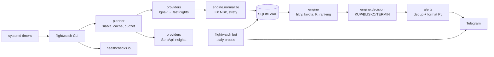

# FlightWatch MVP – projekt systemu

**Status:** Proponowany – czeka na akceptację
**Data:** 2026-10-03
**Feature slug:** `flightwatch-mvp`
**Źródła:** `config.yaml`, `CLAUDE.md`, `PLAN_SESJI.md`, przegląd `reviews/2026-10-03-design-review.md`

## 1. Cel i kryteria sukcesu

Osobisty monitor cen, który dla obserwacji `waw-dps-2026` (2 dorosłych + dziecko 4 lata) zbiera ceny dwa razy dziennie i wysyła na Telegram decyzję KUP / BLISKO / TERMIN.

MVP jest gotowy, gdy:
1. od 11.10.2026 skan poranny i wieczorny działa automatycznie na serwerze;
2. każda oferta ma cenę dla całej grupy, kwotę do zapłaty, koszt K i warunki zmiany powrotu (albo jawne „nieznane”);
3. KUP przychodzi w ciągu 5 minut od obserwacji ceny ≤ 11 000 zł, z linkiem do rezerwacji;
4. zużycie API mieści się w budżecie (Ignav ≤ 8 000/mies., SerpApi ≤ 250/mies.);
5. awaria skanu jest widoczna w ciągu 24 h (heartbeat).

## 2. Zakres

**W MVP (sesje 0–5):**
- lotniska wylotu z dojazdem naziemnym: WAW, KRK, GDN, BER;
- bilet w obie strony na jednym bilecie (`single_ticket`), filtry osobno dla tam i z powrotem;
- warunki zmiany daty powrotu z danych dostawcy lub z `fare_rules.yaml`;
- ranking 3 opcji: najtańsza, najszybsza, kompromis (min K);
- alerty KUP / BLISKO / TERMIN / MISTAKE_FARE, raport dzienny i tygodniowy;
- bot: `/status`, `/top3`, `/kupione`, `/budzet`;
- ocena Google (SerpApi) jako kontekst w raporcie.

**Poza MVP (sesja 6):** osobne bilety przez huby, dolot tanią linią (WMI, VIE, PRG, BUD), warianty `roundtrip_mixed_fare` i `two_oneways_flex_return`, open-jaw, monitor po zakupie, panel Streamlit.

**Nigdy:** hidden city, ML, bilety nagrodowe, automatyczna rezerwacja.

## 3. Architektura

Modularny monolit w Pythonie: jeden pakiet, krótkie procesy uruchamiane przez systemd timer i jeden stały proces bota. Wspólna baza SQLite w trybie WAL (ADR-001).

### Moduły i kontrakty

| Moduł | Odpowiada za | Zależy od |
|---|---|---|
| `config.py` | wczytanie i walidacja `config.yaml` (pydantic v2), `config_hash` | – |
| `db/` | migracje SQL, repozytoria, połączenie (WAL, busy_timeout) | – |
| `providers/` | `Provider` ABC, Ignav, SerpApi, fast-flights, łańcuch awaryjny | `models` |
| `fx.py` | kursy NBP do `fx_rates` | `db` |
| `planner/` | budowa listy `SearchQuery`, cache 60 min, bramka budżetu | `config`, `db` |
| `engine/` | normalizacja, filtry, kwota do zapłaty, K, ranking, decyzja, statystyki | `config`, `models` |
| `alerts/` | formatowanie po polsku, deduplikacja, wysyłka, bot | `db`, `engine` |
| `cli.py` | komendy: `migrate`, `scan --mode full|confirm`, `insights`, `stats`, `report`, `bot`, `budget` | wszystko |

Kluczowe interfejsy (szczegóły w `decisions/architect/flightwatch-mvp.md`):
- `Provider.search(query: SearchQuery) -> list[Offer]`, `Provider.capabilities`, `Provider.cost_per_query`;
- `BudgetLedger.reserve(provider, units) -> bool` przed każdym wywołaniem;
- `evaluate(offer, watch, cfg, fare_rules) -> Evaluation` – czysta funkcja, bez I/O.

## 4. Przebieg skanu

1. Blokada `flock` (jeden skan naraz), wpis w `runs`.
2. Kurs NBP z dnia (albo ostatni ≤ 3 dni z flagą).
3. Planer buduje zapytania: tryb `full` = 4 lotniska × 12 dat wylotu × 4 próbki powrotu = 192; tryb `confirm` = top 20 z ostatnich 24 h.
4. Każde zapytanie: cache (60 min) → rezerwacja budżetu → dostawca → zapis surowej odpowiedzi (gzip) i wiersza w `queries`.
5. Normalizacja do `Offer` (cena grupy, PLN, czasy UTC + lokalne) → upsert `itineraries`/`segments`, insert `offers`.
6. Ocena: filtry → kwota do zapłaty → K → `evaluations`.
7. Spadek najlepszej kwoty ≥ 5% → natychmiastowe potwierdzenie live tej oferty (z pominięciem cache).
8. Decyzja i alerty z deduplikacją w `alerts`.
9. Zamknięcie `runs`, ping heartbeat.

## 5. Ceny i decyzja

- **Kwota do zapłaty** = bilety grupy + bagaż rejestrowany i podręczny dla 3 osób + miejsca obok siebie, w PLN.
- **Koszt K** = kwota + dojazd + `value_of_hour × godziny podróży (tam + z powrotem)` + kary (przesiadki, godziny ponad 24 h, nocna przesiadka, brak elastycznego powrotu).
- **Oferta kwalifikuje się do KUP**, gdy: przechodzi filtry twarde, cena live ≤ 60 min, cena podana dla grupy (nie szacowana), znany koszt bagażu i miejsc, jest link.
- **KUP:** najniższa kwalifikująca się kwota ≤ 11 000 zł. **BLISKO:** ≤ 11 770 zł (raz dziennie). **TERMIN:** od 8.11, gdy nie było KUP (raz). **MISTAKE_FARE:** < 50% mediany z 14 dni, przy ≥ 7 dniach danych, po potwierdzeniu live.
- Alert pokazuje: kwotę dla grupy, cenę za dorosłego, warunki zmiany powrotu, link, top 3 wg rankingu.

## 6. Obsługa błędów

| Błąd | Reakcja |
|---|---|
| timeout, 5xx, 429 | 2 ponowienia z wykładniczym odstępem, potem następny dostawca |
| 401/403, zły klucz | następny dostawca + alert administracyjny raz na dobę |
| koniec budżetu | dostawca pomijany do końca miesiąca, alert przy 80% i 100% |
| błąd parsowania | surowa odpowiedź zostaje, licznik; > 20% błędów w skanie = alert |
| brak kursu NBP | ostatni kurs ≤ 3 dni; starszy = skan bez decyzji KUP |
| Telegram nie działa | alert zostaje w `alerts` jako niewysłany, ponowienie w następnym przebiegu |

## 7. Testy
Testy jednostkowe silnika (czyste funkcje), testy dostawców na zapisanych odpowiedziach, test integracyjny całego skanu na SQLite w pamięci z fałszywym dostawcą i zamrożonym czasem. Szczegóły: `decisions/qa/flightwatch-mvp.md`.

## 8. Wdrożenie
VPS Ubuntu, użytkownik `flightwatch`, `uv`, systemd timers + usługa bota, kopia bazy codziennie poza serwer. Szczegóły: `decisions/devops/` i `decisions/sre/`.

## 9. Pytania otwarte (do akceptacji)
1. Zgoda na zawężenie MVP do WAW/KRK/GDN/BER i biletu w obie strony (warianty elastyczności w sesji 6)?
2. Zgoda na skan warstwowy (rano pełny, wieczorem top 20) zamiast dwóch pełnych?
3. Sesja 6: czy nocleg w hubie wliczać do kwoty do zapłaty przy osobnych biletach?
